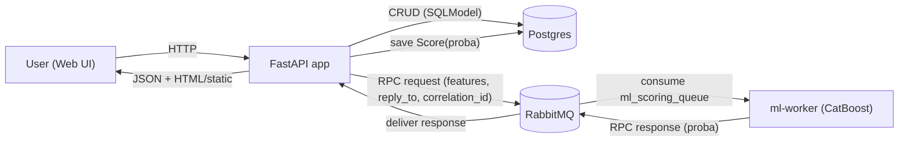

---  

# Проблема и цель проекта

**Проблема**: В текущем процессе кредитования используются статические правила и эвристики. Это приводит к недоодобрениям «хороших» клиентов и переодобрениям «плохих», снижая Net Interest Income и повышая Cost of Risk. 


**Цель**: заменить эвристики промышленным ML‑скорингом с объяснимостью, калибровкой вероятности дефолта и операционным SLA, который поможет снизить Cost of Risk, повысить Net Interest Income при управляемом Approval Rate.

[**Подробнее**](https://github.com/MazzDi/KC.ML-Engeneering.Final-Project/blob/main/mvp/BUSINESS-ANALYSIS.md)

---  

# Целевая аудитория

В первой версии реализован функционал и интерфейс только **для кредитных менеджеров и заемщиков**, но подразумевается также отдельный функционал для андеррайтеров и риск-аналитиков.

[**Подробнее**](https://github.com/MazzDi/KC.ML-Engeneering.Final-Project/blob/main/mvp/PROTOTYPE_DOC.md)

---  

# Тесты моделей и метрики качества

LogisticRegression - [Clear ML link](https://app.clear.ml/projects/9f0684512f9b4de5a3206934a6e151ab/experiments/986facbca13d4bd7b0f249e7d7ab7d86/output/execution)

Basic CatBoost - [Clear ML link](https://app.clear.ml/projects/9f0684512f9b4de5a3206934a6e151ab/experiments/1d6e61ea22b84a2bbb6ba22901ebeee8/output/execution)

ClassBalanced CatBoost - [Clear ML link](https://app.clear.ml/projects/9f0684512f9b4de5a3206934a6e151ab/experiments/421fc592b7914065a80b4732792c8eb7/output/execution)

Optuna CatBoost - [Clear ML link](https://app.clear.ml/projects/9f0684512f9b4de5a3206934a6e151ab/experiments/fbabf6e3255b49eeb2ee9102256129d7/output/execution)

C помощью Optuna был найден оптимальный набор гиперпараметров в 16 трае:
- iterations: 1318
- depth: 7
- learning_rate: 0.12948536188730778
- l2_leaf_reg: 0.12591917720522428
- bagging_temperature: 3.3662956358386733
- random_strength: 4.494464562798268
- border_count: 222
- grow_policy: Depthwise
- min_data_in_leaf: 21
- scale_pos_weight: 0.7502125752281787

Этот набор гиперпараметров дает значение PR-AUC (Average Precision) на уровне 0.96

---

# Описание ML сервиса

Сервис поднимает **API + Web UI** для скоринга клиентов.

- **Клиент**: видит свой профиль, назначенного менеджера, кредит и историю платежей, может запросить/обновить скор.
- **Менеджер**: видит список клиентов, может открыть карточку, редактировать признаки клиента и пересчитывать скор.
- **ML часть**: `ml-worker` считает `predict_proba` CatBoost по RPC через RabbitMQ и возвращает вероятность дефолта (`proba`).

### Компоненты

- **`app/`**: FastAPI + UI (статика) + CRUD слой + модели.
- **`database/`**: подключение к БД и настройки.
- **Postgres**: хранение пользователей/клиентов/менеджеров/кредитов/скорингов.
- **RabbitMQ**: RPC шина для ML воркеров.
- **`ml-worker`**: CatBoost classifier RPC worker (`ml_scoring_queue`).

### Схема работы (end-to-end)



## 1) Проектирование доменной модели сервиса

Доменная модель описана через **SQLModel модели** в `app/models/`:

- **`User`** (`app/models/user.py`): учетная запись (логин/пароль/роль).
- **`Client`** (`app/models/client.py`): профиль клиента + признаки для скоринга, связь с менеджером через `manager_id`.
- **`Manager`** (`app/models/manager.py`): менеджер, связь со списком клиентов.
- **`Credit`** (`app/models/credit.py`): 1 кредит на 1 клиента, включает `payment_history` (JSON).
- **`Score`** (`app/models/scoring.py`): событие скоринга (хранит `score = proba`) + `timestamp` (из base-модели).

Ключевые связи (упрощенно):

- `User 1-1 Client` (по `Client.user_id == User.id`)
- `User 1-1 Manager` (по `Manager.user_id == User.id`)
- `Manager 1-N Client` (по `Client.manager_id`)
- `Client 1-1 Credit` (по `Credit.client_id`, unique)
- `Client 1-N Score` (история скорингов)

### Данные и сущности

- **User**: login/password_hash/role, связка 1-1 с `Client` или `Manager`.
- **Client**: признаки для скоринга + `manager_id`.
- **Manager**: менеджер + список клиентов.
- **Credit**: 1 кредит на 1 клиента (`client_id` unique), `amount_total`, `annual_rate`, `payment_history` (JSON).
- **Score**: событие скоринга (`client_id`, `score` = proba), `timestamp` (из base-модели).

### Как запустить (Docker Compose)

1) Подготовить env:
- файл: `app/.env` (используется в `docker-compose.yaml`)

2) Поднять сервис:

```bash
cd /Users/nskorotkov/GIT/KC.ML-Engeneering.Final-Project-1
docker compose --env-file ./app/.env up -d --build
```

3) Открыть:
- **UI**: `http://localhost/`
- **API** (через прокси): `http://localhost/health`

### Инициализация / seed

`db-init` запускает `app/scripts/seed_db.py` и создаёт тестовые данные:

- 1510 клиентов
- 30 менеджеров (клиенты распределяются равномерно)
- 2 администратора
- каждому клиенту создаётся `Credit` и подгружается `payment_history` из `app/scripts/test_data/credit_history.csv`
- `days_employed_bin` берётся из `df_to_keep.csv` и сохраняется в `Client`

### Скоринг

- Сервис хранит **`Score.score` как вероятность дефолта (`proba`)**.
- В UI отображается “рейтинг” как **`round(1 - proba, 2)`** (чем больше — тем лучше).

### Основные endpoints (высокоуровнево)

- **Health**: `GET /health`
- **Auth (cookie session)**: `POST /auth/login`, `POST /auth/logout`, `GET /auth/me`
- **CRUD API**: `GET /users/{id}`, `GET /clients/{id}`, `GET /managers/{id}`, `GET /managers/{id}/clients`
- **Scoring**: `POST /clients/{client_id}/score`
- **UI API**: маршруты для dashboard клиента/менеджера (см. `app/routes/ui_api.py`)

### Тесты

Тесты на `pytest`, БД в тестах — `sqlite` in-memory.

```bash
pytest -q
```

## 2) Обеспечение хранения данных за счет СУБД

- **СУБД**: Postgres (контейнер `database` в `docker-compose.yaml`).
- **ORM/модели**: SQLModel/SQLAlchemy (`app/models/*`).
- **Подключение/сессии**: `database/database.py` (`get_database_engine()`, `get_session()`).
- **Миграции** не используются: схема создается через `SQLModel.metadata.create_all(...)` при старте seed/тестов.

## 3) Реализация REST интерфейса для взаимодействия с сервисом

- FastAPI приложение: `app/api.py`.
- Роуты вынесены по сущностям в `app/routes/`:
  - `health.py`, `auth.py`, `users.py`, `clients.py`, `managers.py`, `ui_api.py`, `ui_pages.py`
- Вся логика работы с БД идёт **через CRUD слой** в `app/services/crud/` (роуты не ходят в session напрямую “в обход”).

## 4) Реализация пользовательского интерфейса для сервиса

UI реализован как **статические страницы + JS**, которые ходят в backend по cookie-session:

- Статика: `app/static/` (`index.html`, `client.html`, `manager.html`, `credit.html`, `css/*`, `js/*`).
- Страницы отдаёт backend: `app/routes/ui_pages.py`.
- Данные для UI: `app/routes/ui_api.py` (отдельные endpoints для client/manager dashboards).
- Авторизация: `app/routes/auth.py` + `SessionMiddleware` (cookie-based session).

## 5) Обеспечение покрытия тестами критических частей сервиса

Тесты на `pytest` в `tests/`:

- `tests/conftest.py`: in-memory SQLite engine, фикстуры session/TestClient, override dependency `get_session`.
- Покрыты критичные части:
  - CRUD (например `dismiss_manager` и detaching клиентов)
  - REST endpoints (404/200 сценарии)
  - скоринг с mocked RPC (без реального RabbitMQ/воркера)

Команда:

```bash
pytest -q
```


## 6) Упаковка сервиса в Docker контейнер

Контейнеризация через Docker Compose (`docker-compose.yaml`):

- `database` (Postgres)
- `rabbitmq`
- `db-init` (seed)
- `app` (FastAPI)
- `ml-worker` (CatBoost RPC)
- `web-proxy` (nginx)

Общий Python-образ для `app/ml-worker` собирается из `app/Dockerfile`.

## 7) Масштабирование количества воркеров с моделью

`ml-worker` — **stateless consumer** очереди `ml_scoring_queue`. RabbitMQ распределяет сообщения между репликами (competing consumers).

Масштабирование:

```bash
docker compose --env-file ./app/.env up -d --scale ml-worker=3
```

Технические детали:

- RPC реализован через `reply_to` + `correlation_id` (см. `app/services/crud/scoring.py` и `app/ml_worker/main.py`).
- В воркере стоит `basic_qos(prefetch_count=1)` — каждый worker берет по 1 задаче за раз (равномернее балансировка под нагрузкой).

